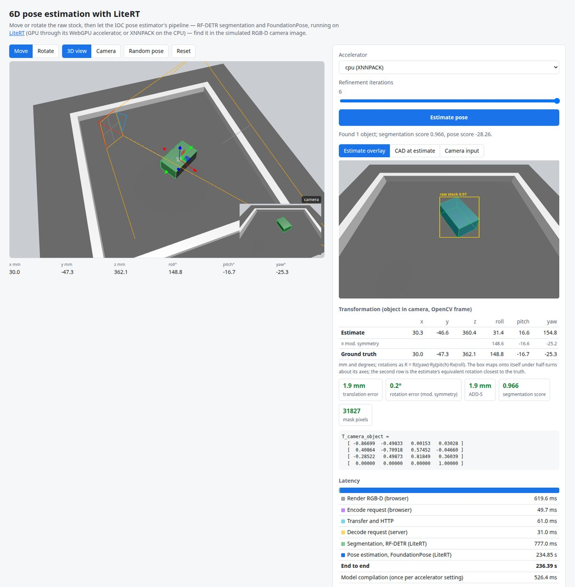

# Web demo



A browser demo of the LiteRT pipeline. A simulated RGB-D camera (the Orbbec
Gemini 335Le of OMTS's Lab BB-01 cell: 1280x800, same intrinsics) looks at
the raw stock on a table. You move and rotate the box in 3D. **Estimate pose**
then:

1. renders what the camera sees: the color image, and a depth image
   (meters along the optical axis, rendered into a float32 target) registered
   to it;
2. sends both to the demo server, which runs the IOC pose estimator service's
   pipeline (RF-DETR segmentation, then FoundationPose with 280 pose
   hypotheses, refinement and scoring) on [LiteRT](https://github.com/google-ai-edge/litert):
   on the GPU through LiteRT's WebGPU accelerator, or with XNNPACK on the CPU;
3. shows the result:
   * the estimated transformation (object in camera, OpenCV frame) next to the
     box's true pose, with translation, rotation and ADD-S errors. The box
     maps onto itself under half-turns, so rotations are compared modulo
     those symmetries;
   * the camera image with the segmentation mask, box and the CAD model
     rendered at the estimated pose; the CAD model alone at the estimate;
   * the estimate as a green ghost in the 3D view;
   * latencies of each step, from rendering in the browser to segmentation
     and pose estimation in LiteRT;
   * where LiteRT ran each network (GPU or CPU, fully delegated or not, and
     why it fell back).

The pipeline is the same C++ code as the ROS node and the Intrinsic service
backend (`cpp/`), used through the Python module (`python/`). It reproduces the
IOC service's outputs (`docs/service_golden.md`).

## Run

With podman (or docker) only, from the repository root:

```bash
podman build -f demo/Containerfile --build-arg ACCEPT_NVIDIA_LICENSE=yes \
    -t litert-pose-demo .
podman run --rm -p 127.0.0.1:8765:8765 litert-pose-demo
# open http://localhost:8765
```

The build downloads NVIDIA's FoundationPose models from NGC and converts
them; `ACCEPT_NVIDIA_LICENSE=yes` accepts NVIDIA's
[Deep Learning Models License Agreement](https://developer.download.nvidia.com/licenses/tao_toolkit_21-08_models_eula.pdf),
and the image then contains the models, so don't publish it. It takes about
45 minutes and 8 GB of memory. The image holds only Python, NumPy, the Vulkan
loader, the module and the page (three.js included, so the page works
offline). For LiteRT's GPU accelerator, give the container a Vulkan driver:
e.g. `--device /dev/dri` and `--build-arg EXTRA_PACKAGES=mesa-vulkan-drivers`
for Mesa, or the NVIDIA Container Toolkit.

Without containers: get the models (`git lfs pull`, and
`tools/fetch_foundationpose.sh --accept-nvidia-license`, see the top-level
README) and build the Python module (needs OpenCV and pybind11; Linux, or
macOS arm64); the server then only needs NumPy:

```bash
cmake -S cpp -B build -DCMAKE_BUILD_TYPE=Release -DPERCEPTION_BUILD_PYTHON=ON \
    -DPython3_EXECUTABLE=$(which python3)
cmake --build build -j
PYTHONPATH=build python3 demo/server.py
# open http://localhost:8765
```

On macOS, OpenCV comes from Homebrew (`brew install opencv@4 pybind11`; the
build prefers OpenCV 4, as the service), and LiteRT's GPU accelerator runs
on Metal. FoundationPose models converted before `tools/gpu_compat.py`
existed need its rewrites to run on Metal (`cd tools &&
../venv/bin/python gpu_compat.py --models=../models`).

| Control | |
| :--- | :--- |
| Move / Rotate (W / E) | Drag the gizmo to move or rotate the box (in its own frame). |
| 3D view / Camera | Orbit around the scene, or look through the camera. The inset shows the camera's view. |
| Random pose, Reset (R) | Put the box at a random resting pose on the table, or back. |
| Accelerator | `auto` uses the GPU if there is a hardware one, `gpu` forces LiteRT's WebGPU accelerator (also on a software Vulkan device), `cpu` uses XNNPACK. |
| CPU fallback | Off: a network that the GPU can't run (or computes other results for than the CPU) makes the estimate fail with the reason. On: that network runs on the CPU, also if the GPU fails later, and the LiteRT section says why. |
| Refinement iterations | The service uses 6. Fewer are faster at some cost in accuracy. |

The first estimate per accelerator setting also compiles the models (shown
as "model compilation" in its latencies). The page loads three.js from
`web/vendor/` (`demo/vendor_three.sh` copies it there, for offline use), else
the server sends it to jsDelivr. The server listens on localhost;
`--host 0.0.0.0` serves other machines.

URL parameters, used by the tests: `accelerator`, `cpu_fallback=1`,
`iterations`, `pose` (4x4
rows as JSON) or `rest=<u>,<v>,<yaw deg>,<face x|y|z>` (a resting pose on the
table), and `autorun` (estimates once loaded and reports the outcome to
`/api/report`). `server.py --save_dir DIR` saves each request's images.

## API

`POST /api/estimate` takes the frame as JSON (`width`, `height`, `rgb` as
base64 RGB bytes, `depth` as base64 float32 meters, `camera_matrix`,
`accelerator`, `cpu_fallback`, `iterations`) and returns for each detection
the box, scores, mask (`numpy.packbits`, base64) and 4x4 pose, plus
`timings_ms` and `accelerators`; errors are `{"error": ...}` with status 400
(bad request) or 500 (e.g. a network that the GPU can't run without
`cpu_fallback`). See `server.py`.

## Tests

```bash
pip install opencv-python-headless   # for the tests only
PYTHONPATH=<dir with litert_pose_estimation*.so>:demo python3 demo/demo_test.py -v
```

* **Server**: the service's recorded capture (`testdata/service_golden`),
  sent through the HTTP API as the page sends frames, gives the service's pose
  (1 mm, 0.5° modulo symmetry, score within 0.05) and segmentation; request
  decoding and errors; static files.
* **WebGPU inference**: the same capture with `accelerator=gpu`. Without
  `cpu_fallback`, every network must run on LiteRT's WebGPU accelerator or the
  request fail, naming the network the GPU can't run. With `cpu_fallback`,
  RF-DETR and the FoundationPose refiner must run on the GPU, any network on
  the CPU must say why, and the detections and pose must be the CPU's (1 mm,
  0.5°).
* **Browser** (headless Chrome, WebGL through SwiftShader): `pose.js`'s unit
  tests (`web/test/pose_test.html`: rotation errors modulo symmetry,
  roll/pitch/yaw, the projection from the camera matrix against the pinhole
  model, mask and base64 decoding, ADD-S); and the whole demo, from the
  rendered RGB-D frame to the estimate, for two box poses on the CPU and one
  on the WebGPU accelerator (with `cpu_fallback`): the box must be found and
  its pose recovered within 5 mm and 5° of the truth (10° on the GPU, run
  with one iteration); and without `cpu_fallback`, the page must report the
  network that the GPU can't run, if any.

The GPU tests need a Vulkan device; a software one (Mesa's llvmpipe) works but
is slow. On macOS they run on Metal. They are skipped without a GPU, the
browser tests without Chrome (`$CHROME` selects the binary). See also `cpp/gpu_test.cc` for the GPU
accelerator tests of the C++ library.
